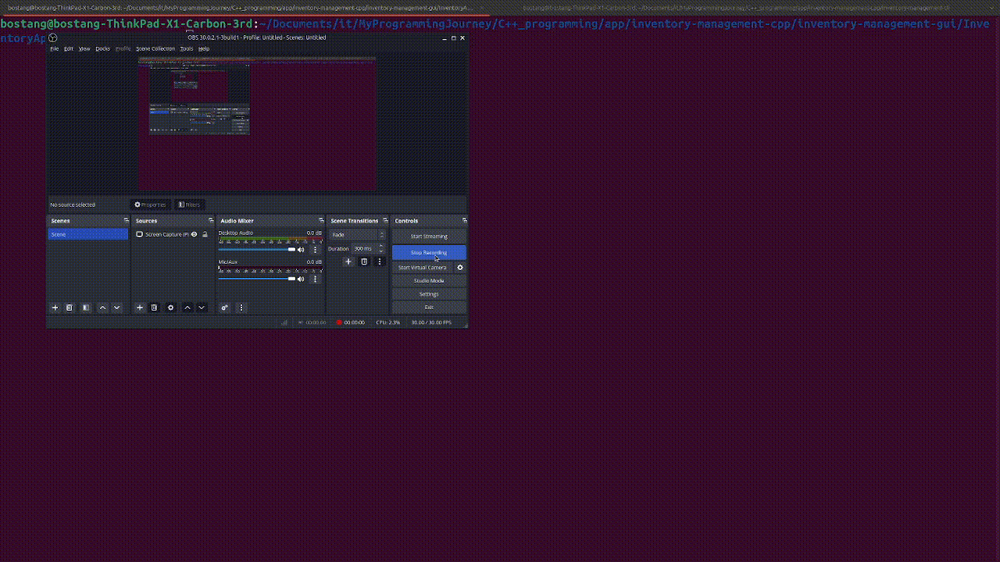
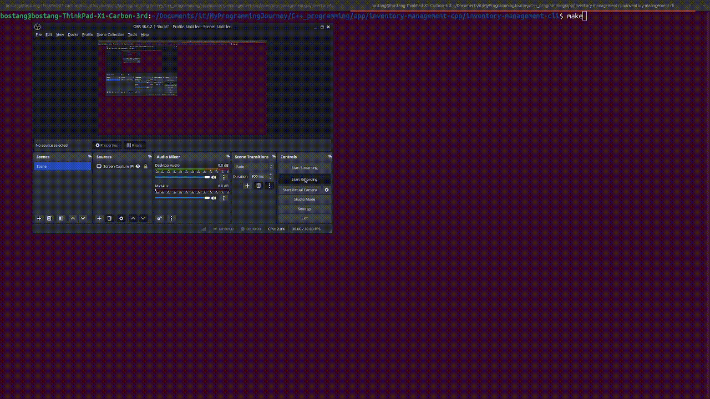

# 📦 Inventory Management System (C++)

Selamat datang di **Inventory Management System**, sebuah aplikasi manajemen inventaris serbaguna yang dibangun dengan C++. Proyek ini menunjukkan implementasi sistem inventaris yang tangguh dengan backend PostgreSQL, menawarkan fleksibilitas melalui antarmuka **Command Line Interface (CLI)** dan **Graphical User Interface (GUI)** berbasis Qt.

Dirancang dengan prinsip modularitas, aplikasi ini memisahkan logika inti bisnis dari lapisan presentasi, memungkinkan pengembangan, pengujian, dan pemeliharaan yang lebih efisien.

## Demonstrasi

### GUI



### CLI



## ✨ Fitur Utama

* **Manajemen Item Inventaris**: Tambah, perbarui, hapus, dan cari item inventaris dengan mudah.
* **Database PostgreSQL**: Data inventaris disimpan secara persisten dan aman menggunakan PostgreSQL, memastikan integritas dan skalabilitas data.
* **Arsitektur Modular**: Logika backend inti sepenuhnya terpisah dari UI, memungkinkan penggunaan kembali kode dan pengembangan paralel.
* **Antarmuka Ganda**:
  * **CLI (Command Line Interface)**: Antarmuka berbasis teks yang efisien untuk operasi cepat dan otomatisasi.
  * **GUI (Graphical User Interface)**: Antarmuka visual yang intuitif dan mudah digunakan, dibangun dengan Qt framework.

## 🚀 Struktur Proyek

Repositori ini terorganisir untuk membedakan antara implementasi CLI dan GUI, sambil berbagi logika inti yang sama.

```tree
.
├── inventory-management-cli/     # Proyek aplikasi Command Line Interface
│   ├── src/                      # Source code CLI (termasuk main.cpp CLI)
│   ├── sql/                      # Script SQL untuk inisialisasi database
│   └── Makefile                  # Build system untuk CLI (jika tidak menggunakan CMake)
├── inventory-management-gui/     # Proyek aplikasi Graphical User Interface (Qt)
│   └── InventoryAppGUI/          # Root proyek Qt
│       ├── src/                  # Source code GUI (main.cpp GUI, mainwindow.h/cpp/ui)
│       ├── build/                # Direktori build CMake/Qt Creator
│       ├── CMakeLists.txt        # Build system untuk GUI (CMake)
│       └── ...                   # File konfigurasi dan generate Qt lainnya
└── README.md                     # README utama repositori ini
```

**Catatan Penting**: Modul logika inti (seperti `DatabaseManager`, `ItemInventaris`, `Utils`) kini berada di lokasi sentral (misalnya, sebagai *library* terpisah) yang di-*link* oleh kedua proyek `inventory-management-cli` dan `inventory-management-gui`. Ini memastikan tidak ada duplikasi kode dan memfasilitasi pemeliharaan.

## 🛠️ Persyaratan Sistem

* **Sistem Operasi**: Linux (Ubuntu/Debian direkomendasikan).
* **Compiler C++**: GCC (g++) atau Clang.
* **CMake**: Versi 3.10 atau lebih baru (untuk proyek GUI).
* **Qt 5**: Library dan *development tools* (misal `qtbase5-dev`, `qttools5-dev`).
* **PostgreSQL**: Database server.
* **libpqxx**: Library C++ untuk PostgreSQL (`libpqxx-dev`).

## ⚙️ Instalasi & Build

### 1\. Klon Repositori

```bash
git clone https://github.com/bostang/inventory-management-cpp.git # Ganti dengan URL repo Anda
cd inventory-management-cpp
```

### 2\. Konfigurasi Database PostgreSQL

* Pastikan PostgreSQL server Anda berjalan.
* Buat database baru (misal `inventaris_db`) dan atur pengguna serta kata sandi yang sesuai.
* Jalankan skrip inisialisasi SQL:

    ```bash
    psql -U your_user -d inventaris_db -f inventory-management-cli/sql/db_init.sql
    ```

    *Ganti `your_user` dan `inventaris_db` sesuai konfigurasi Anda.*

### 3\. Build & Jalankan Versi CLI

Navigasi ke direktori `inventory-management-cli` dan ikuti instruksi `Makefile` yang ada di sana.

```bash
cd inventory-management-cli
make # Atau perintah build CLI Anda
./main # Atau nama executable CLI Anda
```

### 4\. Build & Jalankan Versi GUI

Navigasi ke direktori `inventory-management-gui/InventoryAppGUI`. Proyek ini menggunakan CMake.

```bash
cd inventory-management-gui/InventoryAppGUI
mkdir build && cd build
cmake ..
make
./InventoryAppGUI # Jalankan aplikasi GUI
```

* **Penggunaan Qt Creator**: Anda juga dapat membuka file `CMakeLists.txt` di `inventory-management-gui/InventoryAppGUI` langsung dengan Qt Creator dan membangun serta menjalankannya dari sana.

## 🤝 Kontribusi

Kontribusi disambut baik\! Jika Anda memiliki saran, perbaikan, atau ingin menambahkan fitur baru, jangan ragu untuk membuat *issue* atau mengirimkan *pull request*.

## 📄 Lisensi

Proyek ini dilisensikan di bawah [MIT License](https://www.google.com/search?q=LICENSE).

-----
